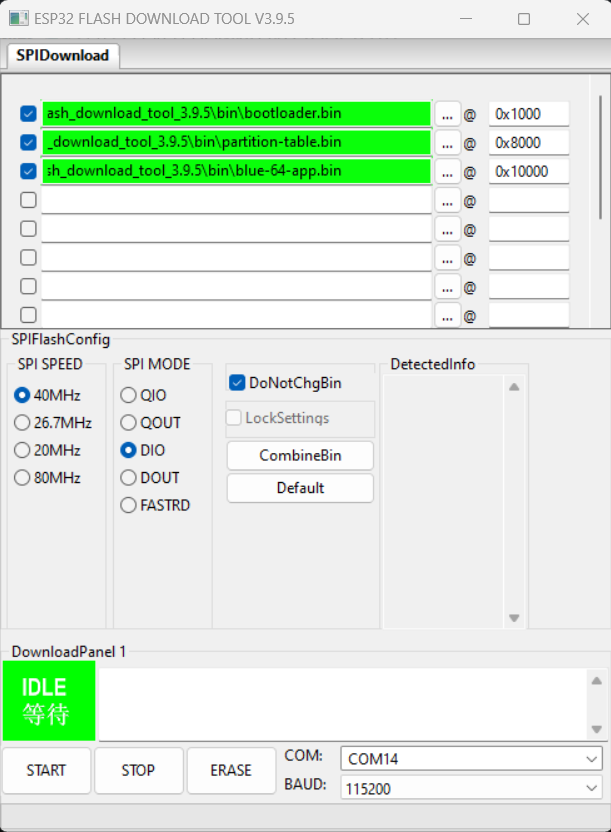

body { font-family: Arial, sans-serif; color: \#333333;
background-color: \#f8f9fa; } h1, h2, h3, h4, h5, h6 { color: inherit;
font-weight: bold; } \#toc, \#toc a { color: inherit; font-weight: bold;
} a { color: \#0056b3; } a:hover { color: \#003366; } .imageblock &gt;
.title { text-align: inherit; }

If you would like to get in touch with the developer, please join the
SPL [Discord](https://discord.gg/gJsCgebkDw) server.

Blue-64 is a plug & play bluetooth adapter for the Commodore 64 that
plugs onto the keyboard header inside the computer and can control the
keyboard lines and emulate keystrokes and joystick inputs. The goal of
the project is to support two bluetooth controllers and a bluetooth
keyboard simultaneously, in order to be able to controll the C64
completely wirelessly.

<figure>

<figcaption>Blue-64 (Developer Board)</figcaption>
</figure>

Blue-64 can be purchased pre-assembled or as a DIY-Kit from these
authorized shops:

-   [Retro8BitShop](https://retro8bitshop.com/product/spl-blue-64/)

-   [Retro-Updates](https://www.retro-updates.com/product/13541624/blue-64-plug-play-bluetooth-for-the-c64)

-   [Restore-Store](https://restore-store.de/home/682-blue-64-v03.html?search_query=blue-64&results=7)

Sales of Blue-64 by any shop other than the ones mentioned above may be
in violation of the [License](#_license) terms and conditions and and be
reported to the developer

# Pairing a Bluetooth Device

The Blue-64 is **always listening to incoming pairing requests** up to a
maximum of three devices paired simultaneously. This means that all you
need to do is set your Bluetooth controller or keyboard in pairing mode
and it will automatically pair with the Blue-64 without the need to set
the Blue-64 itself in pairing mode.

body { font-family: Arial, sans-serif; color: \#333333;
background-color: \#f8f9fa; } h1, h2, h3, h4, h5, h6 { color: inherit;
font-weight: bold; } \#toc, \#toc a { color: inherit; font-weight: bold;
} a { color: \#0056b3; } a:hover { color: \#003366; } .imageblock &gt;
.title { text-align: inherit; }

# Controller Mapping (xInput)

The following key mappings directly apply to xInput devices, such as the
Xbox-One controller. Different controllers such as the Switch controller
and the Playstation 4/5 controller have nearly identical mapping, where
buttons in similar positions perform the same function as their xInput
counterparts

<table style="width:80%;">
<colgroup>
<col style="width: 26%" />
<col style="width: 26%" />
<col style="width: 26%" />
</colgroup>
<thead>
<tr class="header">
<th style="text-align: center;">Joystick</th>
<th style="text-align: center;">Controller</th>
<th style="text-align: center;">Controller Alt.</th>
</tr>
</thead>
<tbody>
<tr class="odd">
<td style="text-align: center;">
UP
</td>
<td style="text-align: center;">
D-Pad UP
</td>
<td style="text-align: center;">
Button B
</td>
</tr>
<tr class="even">
<td style="text-align: center;">
DOWN
</td>
<td style="text-align: center;">
D-Pad DOWN
</td>
<td style="text-align: center;">
Button X
</td>
</tr>
<tr class="odd">
<td style="text-align: center;">
LEFT
</td>
<td style="text-align: center;">
D-Pad LEFT
</td>
<td style="text-align: center;">
Left Analog
</td>
</tr>
<tr class="even">
<td style="text-align: center;">
RIGHT
</td>
<td style="text-align: center;">
D-Pad RIGHT
</td>
<td style="text-align: center;">
Left Analog
</td>
</tr>
<tr class="odd">
<td style="text-align: center;">
FIRE
</td>
<td style="text-align: center;">
Button A
</td>
<td style="text-align: center;">
Button Y (Autofire)
</td>
</tr>
</tbody>
</table>

The "Y Button" is dedicated to autofire, which can be configured from
inactive to 10Hz (100ms) fire-rate through the [on-screen menu](#menu)

Controller buttons not mentioned in the table above can be mapped to
emulate any keyboard key through the [on-screen menu](#menu). Default
Controller-Keyboard mappings are reported below:

<table style="width:80%;">
<colgroup>
<col style="width: 26%" />
<col style="width: 26%" />
<col style="width: 26%" />
</colgroup>
<thead>
<tr class="header">
<th style="text-align: center;">Keyboard</th>
<th style="text-align: center;">Controller</th>
<th style="text-align: center;">SPACE</th>
</tr>
</thead>
<tbody>
<tr class="odd">
<td style="text-align: center;">
Menu Button
</td>
<td style="text-align: center;">
F1
</td>
<td style="text-align: center;">
Right Shoulder
</td>
</tr>
</tbody>
</table>

## Mapping Controller Buttons to Keyboard Keys

1.  Navigate the [on-screen menu](#menu) to the "controller mapping"
    submenu and cycle through the mappable buttons, which will also
    display the current mapping.

2.  Once the desired controller button is highlighted confirm your
    choice with "View + Menu" (controller) or "Alt/AltGr + Enter"
    on(bluetooth keyboard)

3.  If you immediately confirm again, the binding will be removed

4.  You can now press the desired key on the bluetooth keyboard. Visible
    characters will be plotted on screen while modifiers like "shift",
    "control" and "commodore" will be recorded but not displayed.

5.  Alternatively (if you don’t have a bluetooth keyboard) you can cycle
    through all available keys manually.

6.  Confirm the choice with "View + Menu" (controller) or "Alt/AltGr +
    Enter" (bluetooth keyboard) and the last key pressed (or the
    manually selected key, if any) will be assigned to the desired
    control button.

7.  Exiting the submenu without having pressed any key will simply leave
    the mapping unchanged.

# Keyboard Mapping

At the moment Blue-64 **only supports the English US layout**. The key
mapping can be switched between "symbolic" and "positional
([Vice](https://vice-emu.sourceforge.io/vice_1.html#SEC11))" through the
[on-screen menu](#menu). With "symbolic" mapping the keys on the
bluetooth keyboard do exactly what they say on the label, including
their "shift" function (if applicable) with a few exceptions:

<table style="width:80%;">
<colgroup>
<col style="width: 40%" />
<col style="width: 40%" />
</colgroup>
<thead>
<tr class="header">
<th style="text-align: center;">En-US Key (symbolic)</th>
<th style="text-align: center;">C64 Key</th>
</tr>
</thead>
<tbody>
<tr class="odd">
<td style="text-align: center;">
'~'
</td>
<td style="text-align: center;">
Arrow Left
</td>
</tr>
<tr class="even">
<td style="text-align: center;">
'\'
</td>
<td style="text-align: center;">
Arrow Up
</td>
</tr>
<tr class="odd">
<td style="text-align: center;">
6+Shift
</td>
<td style="text-align: center;">
£
</td>
</tr>
<tr class="even">
<td style="text-align: center;">
Tab / Shift+Tab
</td>
<td style="text-align: center;">
Stop / Run
</td>
</tr>
<tr class="odd">
<td style="text-align: center;">
Esc
</td>
<td style="text-align: center;">
Restore
</td>
</tr>
<tr class="even">
<td style="text-align: center;">
Delete, F12
</td>
<td style="text-align: center;">
Clear
</td>
</tr>
<tr class="odd">
<td style="text-align: center;">
Home, F9
</td>
<td style="text-align: center;">
Home
</td>
</tr>
<tr class="even">
<td style="text-align: center;">
Insert, F10
</td>
<td style="text-align: center;">
Insert
</td>
</tr>
<tr class="odd">
<td style="text-align: center;">
Start (Windows)
</td>
<td style="text-align: center;">
Commodore
</td>
</tr>
<tr class="even">
<td style="text-align: center;">
Shift+'\'
</td>
<td style="text-align: center;">
Pi
</td>
</tr>
</tbody>
</table>

body { font-family: Arial, sans-serif; color: \#333333;
background-color: \#f8f9fa; } h1, h2, h3, h4, h5, h6 { color: inherit;
font-weight: bold; } \#toc, \#toc a { color: inherit; font-weight: bold;
} a { color: \#0056b3; } a:hover { color: \#003366; } .imageblock &gt;
.title { text-align: inherit; }

# On-Screen Menu & Additional Functions

Blue-64 has an internal menu that is visualized by printing text on
screen. The menu allows typing and executing frequently used macros like
loading the tape, loading and/or running programs from disk drive etc.
as well as configuring additional preferences such as:

-   Selecting [keyboard mapping profile](#keyboard-map)

-   [Mapping unused controller buttons](#butto-map)

-   Enabling/configuring [Autofire](#autofire)

<table style="width:80%;">
<colgroup>
<col style="width: 40%" />
<col style="width: 40%" />
</colgroup>
<thead>
<tr class="header">
<th style="text-align: center;">Function</th>
<th style="text-align: center;">Button(s)</th>
</tr>
</thead>
<tbody>
<tr class="odd">
<td style="text-align: center;">
Swap Player 1-2
</td>
<td style="text-align: center;">
View + Y
</td>
</tr>
<tr class="even">
<td style="text-align: center;">
Cycle Menu (controller)
</td>
<td style="text-align: center;">
View + A/B
</td>
</tr>
<tr class="odd">
<td style="text-align: center;">
Select/Run Menu (controller)
</td>
<td style="text-align: center;">
View + Menu
</td>
</tr>
<tr class="even">
<td style="text-align: center;">
Exit Menu (controller)
</td>
<td style="text-align: center;">
View + X
</td>
</tr>
<tr class="odd">
<td style="text-align: center;">
Cycle Menu (keyboard)
</td>
<td style="text-align: center;">
Alt/AltGr + Up/Down/Left/Right
Arrow
</td>
</tr>
<tr class="even">
<td style="text-align: center;">
Select/Run Menu (keyboard)
</td>
<td style="text-align: center;">
Alt/AltGr + Enter
</td>
</tr>
<tr class="odd">
<td style="text-align: center;">
Exit Menu (keyboard)
</td>
<td style="text-align: center;">
Alt/AltGr + Backspace
</td>
</tr>
</tbody>
</table>

Please beware that the "view" and "menu" buttons may be called
differently on non xInput devices but are generally in similar positions

Please beware that some controllers, such as 8bitDo or Switch
controllers have X-Y and A-B button labels swapped compared to a regular
Xbox controllers. What matters in this case is the buttons' position,
not the label, so for instance the A button will always be the one of
the bottom regardless of the label

body { font-family: Arial, sans-serif; color: \#333333;
background-color: \#f8f9fa; } h1, h2, h3, h4, h5, h6 { color: inherit;
font-weight: bold; } \#toc, \#toc a { color: inherit; font-weight: bold;
} a { color: \#0056b3; } a:hover { color: \#003366; } .imageblock &gt;
.title { text-align: inherit; }

# Compatibility

## C64 Motherboard Compatibility

Blue-64 has been verified to be compatible with the following C64
motherboard revisions:

<table style="width:80%;">
<colgroup>
<col style="width: 26%" />
<col style="width: 53%" />
</colgroup>
<thead>
<tr class="header">
<th style="text-align: center;">Motherboard</th>
<th style="text-align: center;">Notes</th>
</tr>
</thead>
<tbody>
<tr class="odd">
<td style="text-align: center;">
250407
</td>
<td style="text-align: center;">
-
</td>
</tr>
<tr class="even">
<td style="text-align: center;">
250425
</td>
<td style="text-align: center;">
-
</td>
</tr>
<tr class="odd">
<td style="text-align: center;">
250466
</td>
<td style="text-align: center;">
-
</td>
</tr>
<tr class="even">
<td style="text-align: center;">
326298
</td>
<td style="text-align: center;">
-
</td>
</tr>
<tr class="odd">
<td style="text-align: center;">
ku14194
</td>
<td style="text-align: center;">
-
</td>
</tr>
<tr class="even">
<td style="text-align: center;">
250469
</td>
<td style="text-align: center;">
The developer version of Blue-64
needs a <a href="#shortboard-adapter">special adapter</a> and the female
header is mounted upside down
</td>
</tr>
</tbody>
</table>

<figure id="shortboard-adapter">

<figcaption>Shortboard Adapter</figcaption>
</figure>

## Device Support

Blue-64 is based on the
[bluepad32](https://bluepad32.readthedocs.io/en/latest/) library from
Ricardo Quesada. As such it supports the exact same devices (bluetooth
controllers & keyboards) as bluepad32.

Supported Controllers:
<https://bluepad32.readthedocs.io/en/latest/supported_gamepads/>

Supported Keyboards:
<https://bluepad32.readthedocs.io/en/latest/supported_keyboards/>

## Limitations

-   At the moment Blue-64 only supports Bluetooth Low Energy (BLE)
    devices.

-   Blue-64 can only interact with the lines present on the keyboard
    header, thus it has no access to the "paddle" control lines.
    Therefore it cannot emulate the Commodore mouse, paddle controls,
    and does **not support additional joystick fire buttons** (other
    than the primary one) that are based on paddle control. Luckily
    though, most games supporting additional fire buttons also map them
    to keyboard keys, which can be mapped to controller buttons through
    the on-screen menu.

-   Blue-64 can only perform **one keystroke at a time**, with the
    exception of modifier keys like `control`, `commodore`, `left-shift`
    and `restore` which can all be pressed simultaneously. In order to
    overcome this limitation, when multiple regular keys are pressed
    simultaneously, Blue-64 **always performs the latest keypress**. At
    the same time it remembers the order of the last 8 simultaneous
    keystrokes, in order to trigger new keystrokes in the inverse order
    when the current one is released.

body { font-family: Arial, sans-serif; color: \#333333;
background-color: \#f8f9fa; } h1, h2, h3, h4, h5, h6 { color: inherit;
font-weight: bold; } \#toc, \#toc a { color: inherit; font-weight: bold;
} a { color: \#0056b3; } a:hover { color: \#003366; } .imageblock &gt;
.title { text-align: inherit; }

# Firmware Update

Firmware binaries can be found in the "Releases" section of the GitHub
page. The three files in the "binaries.zip" folder are necessary to
perform a firmware update: - bootloader.bin - partition-table.bin -
application.bin

## "Developer Boards" (up to v0.3)

1.  Download and install the CP210X Universal Windows Drivers for the
    on-board programmer at this website:
    <https://www.silabs.com/developers/usb-to-uart-bridge-vcp-drivers?tab=downloads>

2.  Download the Espressif Flash Download Tool at this website:
    <https://www.espressif.com/en/support/download/other-tools>

3.  Run the .exe application and select "ESP32" as target and "Develop"
    as work mode when prompted. In the following screen upload the three
    binary files in the order at the addresses shown in the screenshot
    below:

    <figure>
    
    <figcaption>ESP Flash Tool</figcaption>
    </figure>

4.  Connect the PC to the USB port on the Blue-64 and select the
    appropriate COM port in the Flash Download Tool. Press the "erase"
    button to erase the FLASH and finally press "start" and the new
    firmware will be downloaded to the board (should take less than a
    minute).

5.  In case the method above does not work, please try the online tool
    at this website: <https://espressif.github.io/esptool-js/>

Don’t worry you can’t brick it (as far as I know), if something fails
you will always be able to re-try flashing the new firmware.

## "Regular Boards" (v1.0 and above)

1.  Format an SD card to FAT32.

2.  Copy application.bin to the root of the SD card.

3.  Switch off the C64 and insert the SD card into the dedicated slot on
    the Blue-64 board.

4.  Switch on the C64, after a few seconds an on-screen prompt will
    state that the update has started. If the prompt does not appear
    within 10 seconds it means that the ESP cannot mount the SD card or
    cannot find the application.bin file in its root.

5.  After about a minute an on-screen prompt will communicate the result
    of the update procedure.

6.  Switch off the C64, remove the SD-Card and switch on again. ,
    Navigate to the Device-Info entry on the on-screen menu and verify
    that the latest version is currently running on the device.

body { font-family: Arial, sans-serif; color: \#333333;
background-color: \#f8f9fa; } h1, h2, h3, h4, h5, h6 { color: inherit;
font-weight: bold; } \#toc, \#toc a { color: inherit; font-weight: bold;
} a { color: \#0056b3; } a:hover { color: \#003366; } .imageblock &gt;
.title { text-align: inherit; }

# Installation & Precautions

Most notably, particular care shall be used when plugging the Blue-64
onto the motherboard, as the female connector on the Blue-64 has no
alignment key and thus won’t prevent incorrect installation. Always
install the Blue-64 with the computer turned off and verify carefully
that the connection to the motherboard header is properly aligned.

A step-by-steb video guide on how to assemble and install the Blue-64
board is available on
[YouTube](https://youtu.be/yE2yL8-_jRQ?si=YmAZqs-F023yzRW5): Users shall
follow these instructions carefully and fully understand the circuit’s
limitations before installing and/or using it.

Incorrect installation of the board supply or failure to comply with the
recommended operating conditions may result in damage to the board
and/or to the computer, with risk of overheating, fire and/or explosion.

# License

License information is included on top of all software source files as
well as in all schematics. Files that do not contain explicit licensing
information are subject to the licensing terms stated in the LICENSE.txt
provided in the main project folder:

Unless stated otherwise in individual files, all hardware design
Schematics, Bill of Materials, Gerber files and manuals are licensed
under Creative Commons Attribution-NonCommercial-ShareAlike 4.0
International. To view a copy of this license, visit
<http://creativecommons.org/licenses/by-nc-sa/4.0/>

Unless otherwise stated in individual files, all software source files
are Licensed under the Apache License, Version 2.0. You may obtain a
copy of this license at <http://www.apache.org/licenses/LICENSE-2.0>

# Disclaimer

All material is provided on an 'AS IS' BASIS, WITHOUT WARRANTIES OR
CONDITIONS OF ANY KIND in accordance to the license deed applicable to
each individual file.
