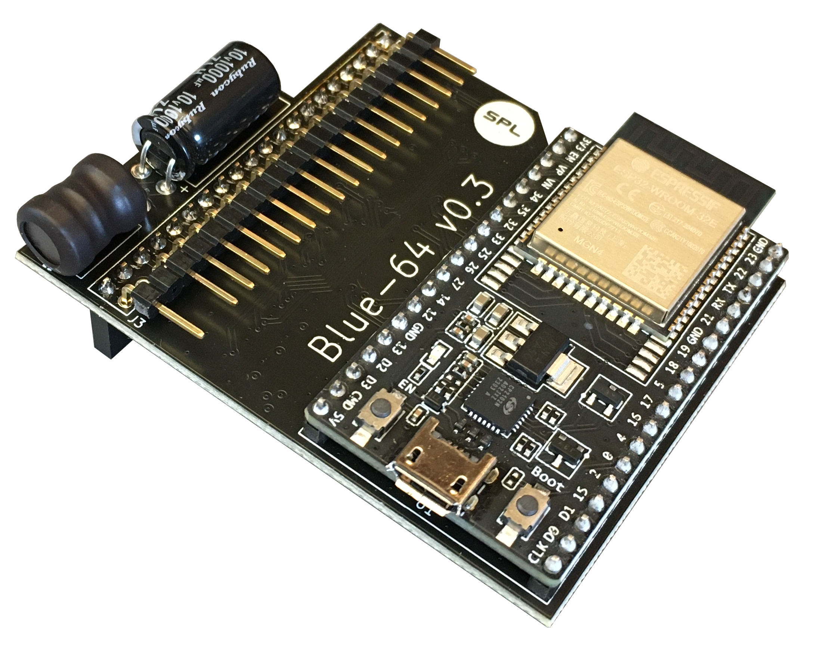
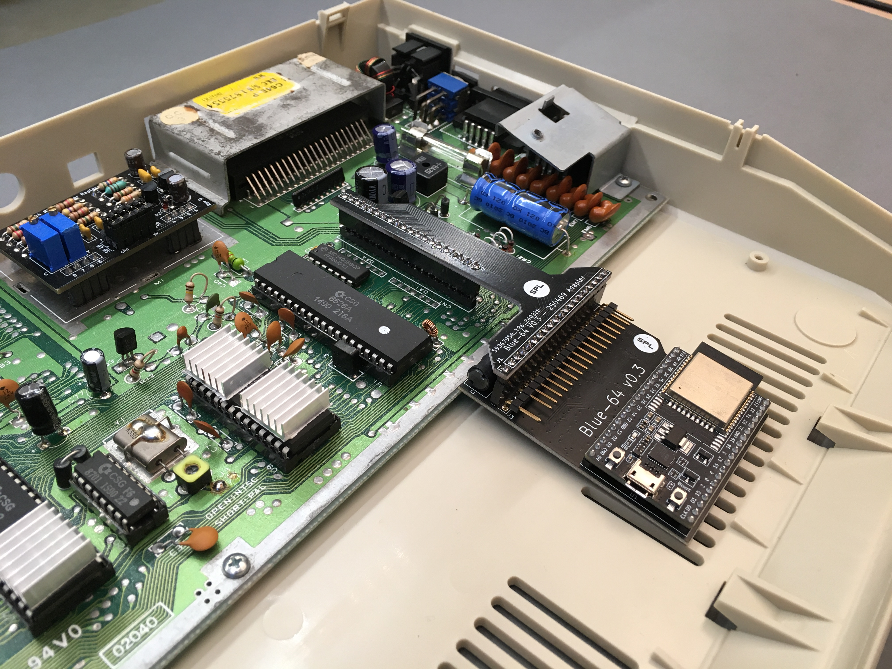

# Blue-64 <!-- omit in toc -->

If you would like to get in touch with the developer, please join the SPL [Discord](https://discord.gg/gJsCgebkDw) server.

Blue-64 is a plug & play bluetooth adapter for the Commodore 64 that plugs onto the keyboard header inside the computer and can control the keyboard lines and emulate keystrokes and joystick inputs. The goal of the project is to support two bluetooth controllers and a bluetooth keyboard simultaneously, in order to be able to controll the C64 completely wirelessly.

Blue-64 can be purchased pre-assembled or as a DIY-Kit from these authorized shops:

- [Retro8BitShop](https://retro8bitshop.com/product/spl-blue-64/)
- [Retro-Updates](https://www.retro-updates.com/product/13541624/blue-64-plug-play-bluetooth-for-the-c64)
- [Restore-Store](https://restore-store.de/home/682-blue-64-v03.html?search_query=blue-64&results=7)

Sales of Blue-64 by any shop other than the ones mentioned above may be in violation of the [License](#10-license) terms and conditions and and be reported to the developer

# Table of Contents <!-- omit in toc -->

* [1. C64 Compatibility](#1-c64-compatibility)
* [2. Device Support](#2-device-support)
* [3. Keyboard Support](#3-keyboard-support)
* [4. Pairing a Bluetooth Device](#4-pairing-a-bluetooth-device)
* [5. Additional functions](#5-additional-functions)
* [6. Button Mapping (xInput)](#6-button-mapping-xinput)
* [7. Limitations](#7-limitations)
* [8. Installation \& Precautions](#8-installation--precautions)
* [9. Firmware Update](#9-firmware-update)
	* [9.1. "Developer Boards" (up to v0.3)](#91-developer-boards-up-to-v03)
	* [9.2. "Regular Boards" (v1.0 and above)](#92-regular-boards-v10-and-above)
* [10. License](#10-license)
* [11. Disclaimer](#11-disclaimer)

<figure align="center">
	
	<figcaption>Blue-64 v0.3</figcaption>
</figure>

# 1. C64 Compatibility
Blue-64 has been verified to be compatible with the following C64 motherboard revisions:

| Motherboard | Notes   |
|:---:        |:---:    |
| 250407  | - |
| 250425  | - |
| 250466  | - |
| 326298  | - |
| ku14194 | - |
| 250469  | Needs a special adapter and the female header is mounted upside down |

<figure align="center">
	
	<figcaption>Shortboard Adapter</figcaption>
</figure>

Blue-64 is also expected to be compatible with C16 and VIC20 computers, though has not been thoroughly tested yet.

# 2. Device Support
Blue-64 is based on the bluepad32 library from Ricardo Quesada. As such it supports the exact same devices (bluetooth controllers & keyboards) as bluepad32.

Supported Controllers: https://bluepad32.readthedocs.io/en/latest/supported_gamepads/

Supported Keyboards: https://bluepad32.readthedocs.io/en/latest/supported_keyboards/

# 3. Keyboard Support
At the moment Blue-64 only supports Bluetooth-Low-Energy keyboards (BLE) and only supports the English US layout. The key mapping can be switched between "symbolic" and "positional (vice)" through the on-screen menu. With "symbolic" mapping the keys on the bluetooth keyboard do exactly what they say, including their "shift" function (if applicable) with a few exceptions:

| En-US Key (symbolic) | C64 Key     |
|:---:                 |:---:        |
| ~                    | Arrow Left  |
| \                    | Arrow Up    |
| 6+shift              | £           |
| tab / shift+tab      | Stop / Run  |
| esc                  | Restore     |
| delete, f12          | Clear       |
| home, f9             | home        |
| insert, f10          | insert      |
| start (windows)      | Commodore   |

# 4. Pairing a Bluetooth Device
The Blue-64 is always listening to incoming pairing requests up to a maximum of three devices paired simultaneously. This means that all you need to do is set your Bluetooth controller or keyboard in pairing mode and it will automatically pair with the Blue-64 without the need to set the Blue-64 itself in pairing mode.

# 5. Additional functions
Blue-64 has an internal menu that is visualized by printing text on screen. The menu allows typing and executing frequently used macros like loading the tape, loading and/or running programs from disk drive etc. as well as selecting keyboard mapping and remapping unused controller buttons.

| Function                       | Button(s)   |
|:---:                           |:---:        |
| Swap Player 1-2                | View + Y    |
| Cycle Menu (controller)        | View + A/B  |
| Select/Run Menu (controller)   | View + Menu |
| Exit Menu (controller)         | View + X    |
| Cycle Menu (keyboard)          | AltGr + Up/Down/Left/Right Arrow  |
| Select/Run Menu (keyboard)     | AltGr + Enter |
| Exit Menu (keyboard)           | AltGr + Backspace |

# 6. Button Mapping (xInput)
| Joystick     | Controller  | Controller Alt.     |
|:---:         |:---:        |:---:                |
| UP           | D-Pad UP    | Button B            |
| DOWN         | D-Pad DOWN  | Button X            |
| LEFT         | D-Pad LEFT  | Left Analog         |
| RIGHT        | D-Pad RIGHT | Left Analog         |
| FIRE         | Button A    | Button Y (Autofire) |

The "Y Button" is dedicated to autofire, which can be configured from inactive to 10Hz (100ms) fire-rate through the on-screen menu

Controller buttons not mentioned in the table above can be mapped to emulate any keyboard key through the on-screen menu. Default Controller-Keyboard mappings are reported below:

| Keyboard     | Controller     |
|:---:         |:---:           |
| SPACE        | Menu Button    |
| F1           | Right Shoulder |

* In order to map a button navigate to the "controller mapping" submenu and cycle through the mappable buttons, which will also display the current mapping.
* Once the desired controller button is highlighted confirm your choice with "View + Menu" (controller) or "AltGr + Enter" on(bluetooth keyboard)
* If you immediately confirm again, the binding will be removed
* You can now press the desired key on the bluetooth keyboard. Visible characters will be plotted on screen while modifiers like "shift", "control" and "commodore" will be recorded but not displayed.
* Alternatively (if you don't have a bluetooth keyboard) you can cycle through all available keys manually.
* Confirm the choice with "View + Menu" (controller) or "AltGr + Enter" (bluetooth keyboard) and the last key pressed (or the manually selected key, if any) will be assigned to the desired control button.
* Exiting the submenu without having pressed any key will simply leave the mapping unchanged.

# 7. Limitations
Blue-64 can only interact with the lines present on the keyboard header, thus it has no access to the "paddle" control lines. Therefore it cannot emulate the Commodore mouse, paddle controls, and does not support additional joystick fire buttons (other than the primary one) that are based on paddle control.

Luckily though, most games supporting additional fire buttons also map them to keyboard keys, which can be mapped to controller buttons through the on-screen menu.

# 8. Installation & Precautions
Most notably, particular care shall be used when plugging the Blue-64 onto the motherboard, as the female connector on the Blue-64 has no alignment key and thus won't prevent incorrect installation. Always install the Blue-64 with the computer turned off and verify carefully that the connection to the motherboard header is properly aligned.

A step-by-steb video guide on how to assemble and install the Blue-64 board is available at the following link:
https://youtu.be/yE2yL8-_jRQ?si=YmAZqs-F023yzRW5
Users shall follow these instructions carefully and fully understand the circuit's limitations before installing and/or using it.

Incorrect installation of the board supply or failure to comply with the recommended operating conditions may result in damage to the board and/or to the computer, with risk of overheating, fire and/or explosion.

# 9. Firmware Update
Firmware binaries can be found in the "Releases" section of the GitHub page. The three files in the "binaries.zip" folder are necessary to perform a firmware update:
- bootloader.bin
- partition-table.bin
- application.bin

## 9.1. "Developer Boards" (up to v0.3)
Download and install the CP210X Universal Windows Drivers for the on-board programmer at this website:
https://www.silabs.com/developers/usb-to-uart-bridge-vcp-drivers?tab=downloads

Download the Espressif Flash Download Tool at this website:
https://www.espressif.com/en/support/download/other-tools

Run the .exe application and select "ESP32" as target and "Develop" as work mode when prompted. In the following screen upload the three binary files in the order at the addresses shown in the screenshot below:

Connect the PC to the USB port on the Blue-64 and select the appropriate COM port in the Flash Download Tool. Press the "erase" button to erase the FLASH and finally press "start" and the new firmware will be downloaded to the board (should take less than a minute).

In case the method above does not work, please try the online tool at this website:
https://espressif.github.io/esptool-js/

Don't worry you can't brick it (as far as I know), if something fails you will always be able to re-try flashing the new firmware.

## 9.2. "Regular Boards" (v1.0 and above)
- Format an SD card to FAT32.
- Copy application.bin to the root of the SD card.
- Switch off the C64 and insert the SD card into the dedicated slot on the Blue-64 board.
- Switch on the C64, after a few seconds an on-screen prompt will state that the update has started. If the prompt does not appear within 10 seconds it means that the ESP cannot mount the SD card or cannot find the application.bin file in its root.
- After about a minute an on-screen prompt will communicate the result of the update procedure.
- Switch off the C64, remove the SD-Card and switch on again.
- Navigate to the Device-Info entry on the on-screen menu and verify that the latest version is currently running on the device.

# 10. License
License information is included on top of all software source files as well as in all schematics. Files that do not contain explicit licensing information are subject to the licensing terms stated in the LICENSE.txt provided in the main project folder:

Unless stated otherwise in individual files, all hardware design Schematics, Bill of Materials, Gerber files and manuals are licensed under Creative Commons Attribution-NonCommercial-ShareAlike 4.0 International. To view a copy of this license, visit http://creativecommons.org/licenses/by-nc-sa/4.0/

Unless otherwise stated in individual files, all software source files are Licensed under the Apache License, Version 2.0. You may obtain a copy of this license at http://www.apache.org/licenses/LICENSE-2.0

# 11. Disclaimer
All material is provided on an 'AS IS' BASIS, WITHOUT WARRANTIES OR
CONDITIONS OF ANY KIND in accordance to the license deed applicable to
each individual file.
